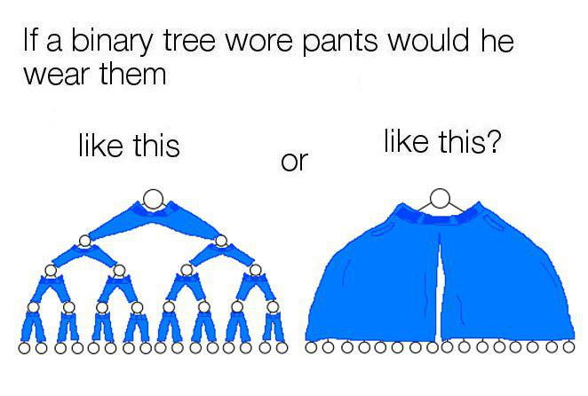
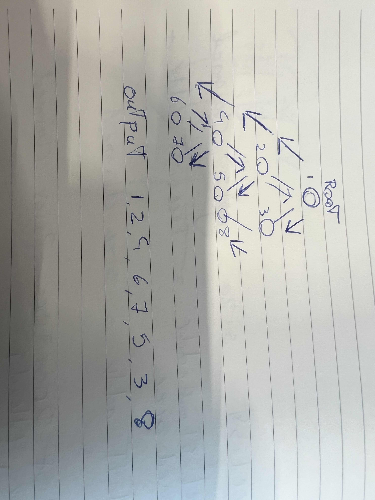
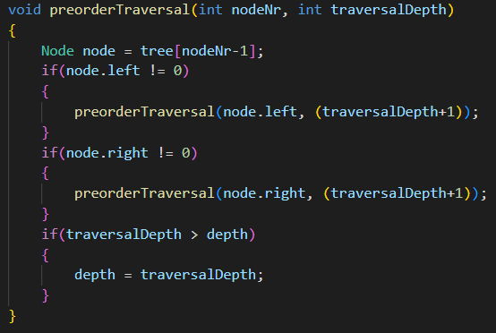
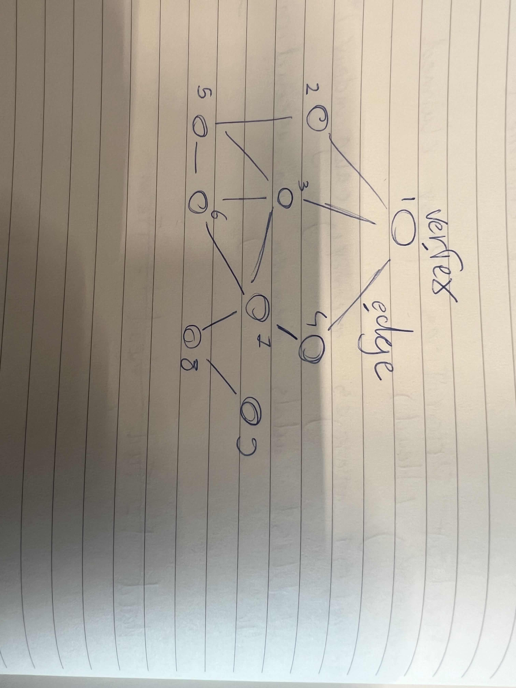

# Binary trees, Graphs, recursion and you!  
navigating directed and undirected datastructres

  
## Preface
Binary trees & graphs are datastructures that are similar but navigated in different ways. for this assignment we will navigate simple and complex binary trees, and graphs with pre-order traversal and breadth-first search traversal respectively.  

## Binary Trees.
Binary trees are structures that stem from a single root, and expand in a left or right direction (hence the name). 
there are 4 major ways to navigate these data structures: In-Order, Pre-Order, Post-Order, and Level-Order traversal.  
for this document i will only be focussing on Pre-Order traversal.

    Pre-order traversal nagivates a tree from the left first, and then after checking the left node, checks the right node

applying this theory to programming, with a recursive function you first navigate the left side of a node, or your right as your recursive case. in your base case, you simply return or do nothing, letting the function terminate and go back to the caller.
in code that function takes it shape like so  

this function stores a node from the tree (-1 for correct index), and then first checks its left branch for contents. and then its left. in both cases the depth is iterated on.  
if the node has both its branches explored, it will check if the traversal depth has become more than the depth, if so it will correct the depth with itself.

## Graphs
Graphs are like trees, but can be explored from any node as entry point, and are not limited to only having two branches per node. they can also be bidirectional. this is represented as a graph having vertices and edges, like a physical object.

graphs have two ways of traversal, breadth first and depth first search. BFS or DFS for short.
In this assignment i have opted for a BFS implementation as that seemed the simplest of the two.
BFS consists of 5 steps
1. Add a node/vertex from the graph to a queue of nodes to be “visited”.
2. Visit the topmost node in the queue, and mark it as such.
3. If that node has any neighbors, check to see if they have been “visited” or not.
4. Add any neighboring nodes that still need to be “visited” to the queue.
5. Remove the node we've visited from the queue.
   
but before we can do that, we need to read a dataset into local memory to search through. heres how 
we accomplish this.  

the first line of this textfile represents the amount of tests in this specific file.  
the next line has two values, the first is the amount of nodes in the given test,
and the amount of lines that follow  which contain the connects of the given nodes

we take these values and store them in a matrix.  
after the values of this test are stored in the matrix, we can then use it to find the shortest path as described earlier with BFS.  
when you have found the last node in the graph, you add the distance of it to the array, and then print it.

## Sources
1. https://medium.com/basecs/going-broad-in-a-graph-bfs-traversal-959bd1a09255